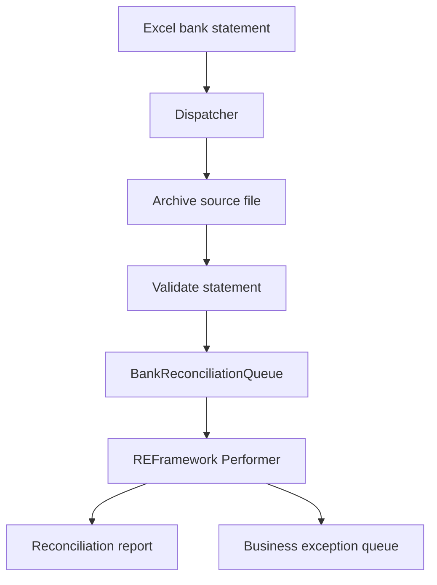

Use the following as `README.md` in each repository. Replace the companion-repository placeholders with your actual GitHub URLs.

**Dispatcher repository — `README.md`**

```markdown
# Bank Reconciliation Dispatcher

A UiPath automation that validates an Excel bank statement, archives the source file, and sends transactions to an Orchestrator queue for reconciliation.

This repository contains the Dispatcher. A separate REFramework Performer retrieves the queue items, matches them against a dummy ledger, produces a CSV report, and routes business exceptions for investigation.

**Companion repository:** [Bank Reconciliation Performer](https://github.com/ishaq12web/uipath-bank-reconciliation-performer)

## Project status

Working portfolio demonstration using synthetic transaction data.

The Dispatcher and Performer have been exercised together. The Performer has also been tested with matched and missing-ledger transactions.

This is a demonstration project, not a production banking deployment.

## Business problem

Manual reconciliation requires staff to check statement files, identify invalid records, compare transactions against ledger entries, and investigate differences.

The Dispatcher prepares validated, traceable work items so reconciliation can run independently through the Performer.

## Architecture



## Features

- Selects a bank statement using the `BankStatement_*.xlsx` pattern.
- Requires exactly one matching input file.
- Generates a run identifier for traceability.
- Copies the source file into a run-specific archive folder.
- Checks that the archive file exists.
- Reads the `Transactions` worksheet.
- Rejects empty statements and missing required columns.
- Detects duplicate, non-empty bank transaction IDs within the statement.
- Checks each row for a bank transaction ID and reference.
- Normalizes currency values and validates NGN.
- Collects validation errors before dispatching.
- Creates an Orchestrator queue item for each validated transaction.

## Technology

- UiPath Studio Desktop
- C# workflow expressions
- UiPath Excel and System activities
- UiPath Orchestrator queues
- Excel input and file-based archiving

## Input format

Place one matching workbook in:

`Data/Input/`

Example filename:

`BankStatement_20260917.xlsx`

The workbook must contain a worksheet named `Transactions` with these columns:

| Column | Purpose |
|---|---|
| BankTxnId | Bank transaction identifier |
| AccountNumber | Account identifier, including leading zeros |
| TransactionDate | Transaction date |
| ValueDate | Value date |
| Reference | Reference used for ledger matching |
| Description | Transaction description |
| Debit | Debit amount |
| Credit | Credit amount |
| Currency | Currency code |

Use synthetic data for demonstrations. Store account numbers as text to preserve leading zeros.

For compatibility with the current Performer, queue date values must use `yyyy-MM-dd`. Amounts may use plain digits or comma-separated thousands, with up to two decimal places. A dash represents zero.

## Queue contract

Queue name: `BankReconciliationQueue`

Queue item Reference: trimmed `BankTxnId`

Specific Content:

| Key | Source |
|---|---|
| BankTxnId | BankTxnId column |
| AccountNumber | AccountNumber column |
| TransactionDate | TransactionDate column |
| ValueDate | ValueDate column |
| TransactionReference | Reference column |
| Description | Description column |
| Debit | Debit column |
| Credit | Credit column |
| Currency | Normalized Currency column |
| RunId | Dispatcher run identifier |
| SourceFile | Input filename |
| ArchiveFilePath | Archived source path |

The Excel column `Reference` is published as `TransactionReference`.

## Setup and execution

1. Clone the repository and open `project.json` in UiPath Studio.
2. Restore the activity dependencies.
3. Connect Studio and the Robot to your Orchestrator tenant.
4. Create `BankReconciliationQueue` in an accessible folder.
5. Review the Add Queue Item folder setting and replace any developer-specific workspace path.
6. Create `Data/Input` and place one synthetic statement there.
7. Confirm the worksheet name and required columns.
8. Run the Dispatcher entry workflow.
9. Verify the archived file and the new queue items.
10. Run the companion Performer.

Where unique queue references are enabled, submitting the same BankTxnId again can produce a duplicate-reference error.

## Archive behavior

Input files are copied to:

`Data/Archive/<RunId>/<SourceFile>`

This preserves the source used for a run. It is an archive mechanism; automatic recovery and resumption after a partial dispatch are not yet implemented.

## Known limitations

- One statement file is handled per run.
- Currency validation currently permits NGN only.
- Detailed amount and transaction-date validation occurs in the Performer.
- A queue submission failure can leave a partially dispatched statement.
- Duplicate checking within the workbook does not establish whether an item already exists in Orchestrator.
- A local archive path may not be accessible from another robot machine.
- Queue creation, permissions, and folder configuration require environment setup.

## Planned improvements

- Move remaining hardcoded settings into configuration.
- Add dispatch checkpoints and safe resumption.
- Document negative validation tests.
- Add shared archive storage for multiple robot machines.
- Add reconciliation against an API-backed ledger.

## Author

Ishaku Danladi
